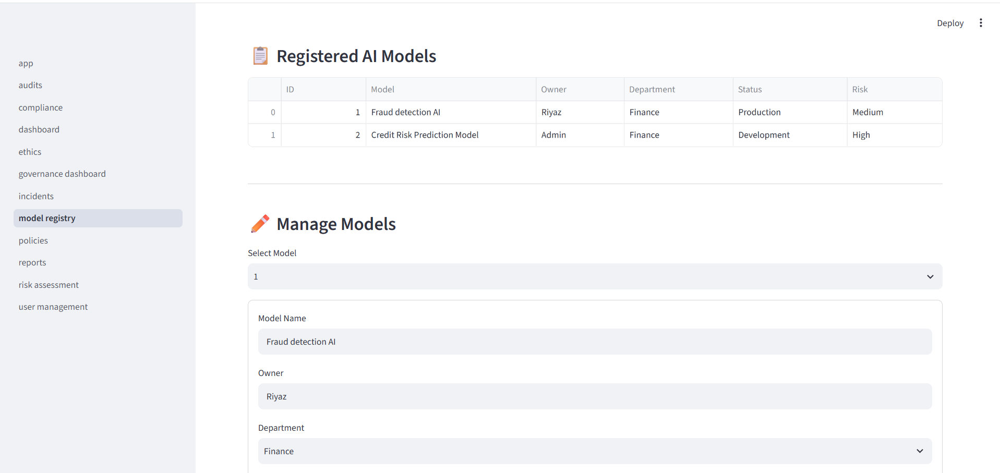
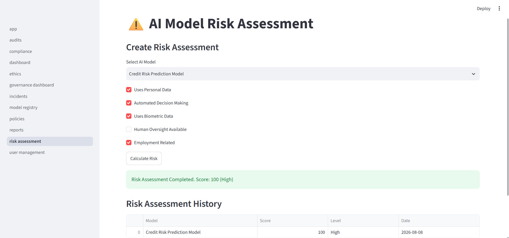
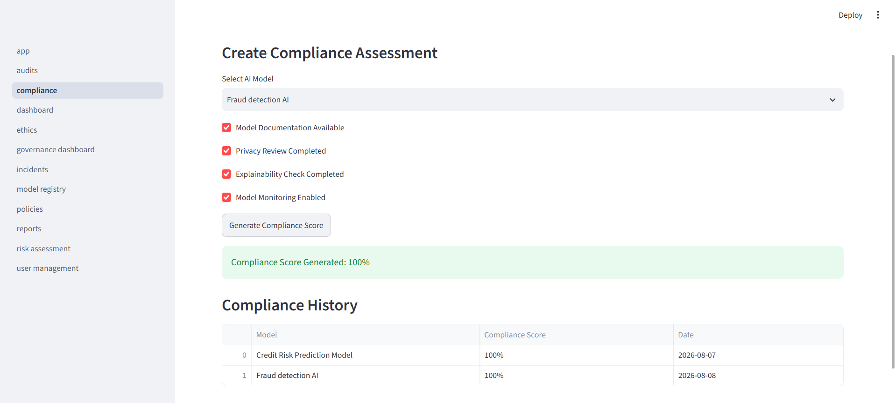
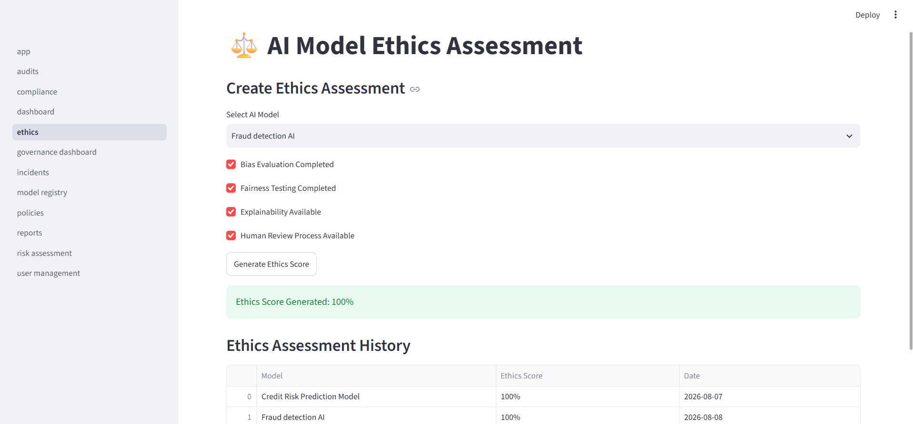
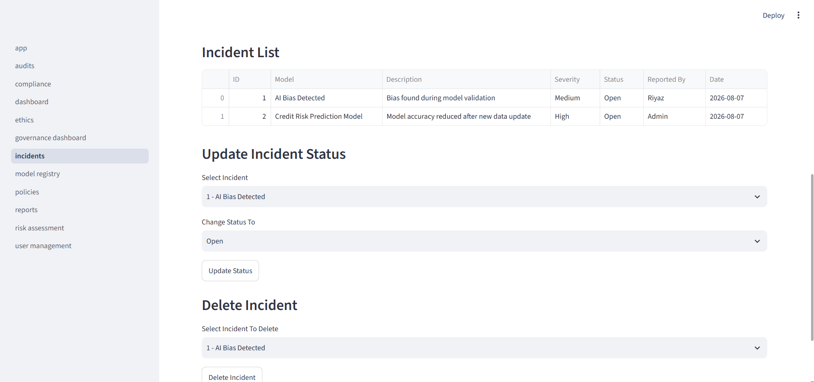
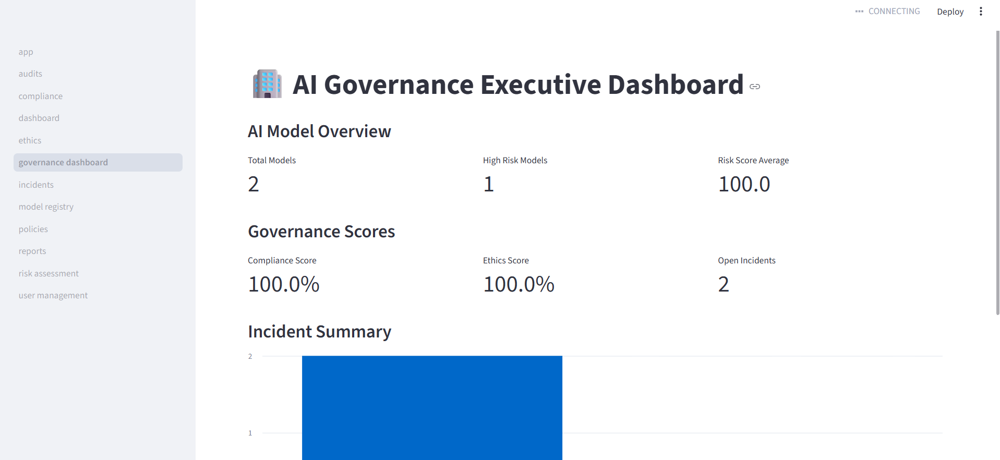

# 🏢 AI Governance Management System

## Project Overview

The AI Governance Management System is a platform designed to manage and monitor the complete lifecycle of Artificial Intelligence models.

The system helps organizations maintain transparency, assess AI model risks, evaluate compliance and ethical standards, manage AI-related incidents, and monitor overall governance status through an executive dashboard.

This project demonstrates how organizations can build a structured governance framework around AI systems.

---

## Live Demo

Application URL:

https://ai-governance-management-system-9masimkzwcbnxlywnupq3e.streamlit.app/

# Features

## 1. AI Model Registry

The AI Model Registry manages information about AI models used within an organization.

### Features:

- Register AI models
- Store model ownership information
- Track department details
- Maintain model purpose
- Store dataset information
- Manage model versions
- Track deployment status
- Define model risk level

---

## 2. AI Risk Assessment

The Risk Assessment module evaluates potential risks associated with AI models.

### Risk Factors:

- Personal data usage
- Automated decision making
- Biometric data usage
- Human oversight availability
- Employment-related impact

### Capabilities:

- Select registered AI models
- Calculate risk score automatically
- Classify models based on risk level

Risk Levels:

- Low
- Medium
- High

---

## 3. Compliance Assessment

The Compliance Assessment module evaluates whether AI models follow governance requirements.

### Compliance Checks:

- Model documentation availability
- Privacy review completion
- Explainability verification
- Model monitoring process

### Output:

- Compliance score generation
- Compliance history tracking

---

## 4. Ethics Assessment

The Ethics Assessment module focuses on responsible AI practices.

### Ethics Checks:

- Bias evaluation
- Fairness testing
- Explainability availability
- Human review process

### Output:

- Ethics score generation
- Ethics assessment history

---

## 5. Incident Management

The Incident Management module tracks problems and issues related to AI models.

### Features:

- Create AI incidents
- Link incidents with affected models
- Record incident severity
- Track reported issues
- Update incident status
- Delete resolved or incorrect incidents

### Incident Status:

- Open
- In Progress
- Resolved
- Closed

---

## 6. Governance Dashboard

The Executive Governance Dashboard provides a high-level view of AI governance status.

### Dashboard Metrics:

- Total AI models
- High-risk models
- Average risk score
- Compliance score
- Ethics score
- Open incidents
- Resolved incidents

---

# System Architecture

```
                 AI Model Registry
                        |
                        |
                        ↓
                Risk Assessment
                        |
                        |
                        ↓
             Compliance Assessment
                        |
                        |
                        ↓
                Ethics Assessment
                        |
                        |
                        ↓
             Incident Management
                        |
                        |
                        ↓
          Executive Governance Dashboard
```

---

# Technology Stack

## Programming Language

- Python

## Frontend

- Streamlit

## Backend

- Python
- SQLAlchemy ORM

## Database

- SQLite

## Data Processing

- Pandas

---

# Project Structure

```
AI-Governance-Management-System

│
├── app.py
│
├── database
│   ├── connection.py
│   └── models.py
│
├── pages
│   ├── model_registry.py
│   ├── risk_assessment.py
│   ├── compliance.py
│   ├── ethics.py
│   ├── incidents.py
│   ├── dashboard.py
│   └── governance_dashboard.py
│
├── requirements.txt
│
└── README.md
```

---

# Installation and Setup

## Step 1: Clone Repository

```
git clone <repository-url>
```

## Step 2: Navigate to Project Directory

```
cd AI-Governance-Management-System
```

## Step 3: Create Virtual Environment

```
python -m venv venv
```

## Step 4: Activate Virtual Environment

For Windows:

```
venv\Scripts\activate
```

## Step 5: Install Dependencies

```
pip install -r requirements.txt
```

## Step 6: Run Application

```
python -m streamlit run app.py
```

---

# Database Design

The system uses relational database design.

Main Entities:

## AIModel

Stores AI model information.

Contains:

- Model name
- Owner
- Department
- Purpose
- Dataset
- Version
- Status
- Risk level

---

## RiskAssessment

Stores AI model risk evaluation.

Contains:

- Risk factors
- Risk score
- Risk level
- Assessment date

---

## ComplianceAssessment

Stores compliance evaluation results.

Contains:

- Compliance score
- Assessment date

---

## EthicsAssessment

Stores ethical evaluation results.

Contains:

- Ethics score
- Assessment date

---

## Incident

Stores AI model incidents.

Contains:

- Affected model
- Description
- Severity
- Status
- Reporter
- Incident date

---

# Future Enhancements

Future improvements planned:

- Real-time AI model monitoring
- Automated bias detection
- Role-based access control
- User authentication
- Cloud deployment
- ML pipeline integration
- Automated governance alerts
- AI performance monitoring

---

# Learning Outcomes

Through this project, the following concepts were implemented:

- Python application development
- Database design using SQLAlchemy
- Streamlit web application development
- CRUD operations
- Relational database relationships
- AI governance concepts
- Risk scoring systems
- Dashboard development

---

# Author

Mohammed Riyaz

## 📸 Application Screenshots

### AI Model Registry



### Risk Assessment



### Compliance Assessment



### Ethics Assessment



### Incident Management



### AI Governance Executive Dashboard

